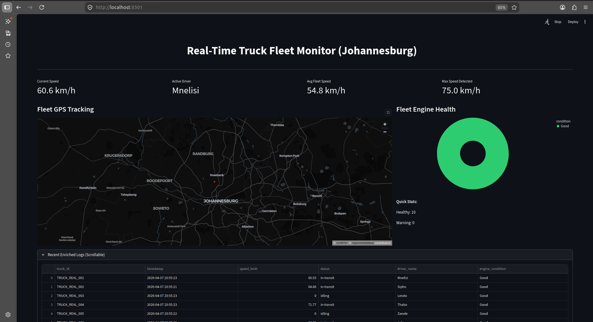
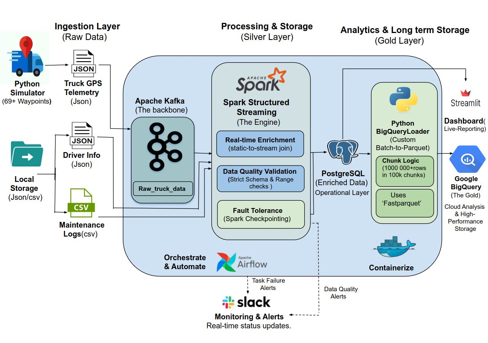
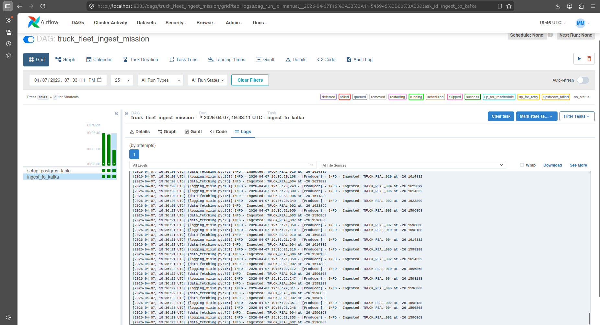
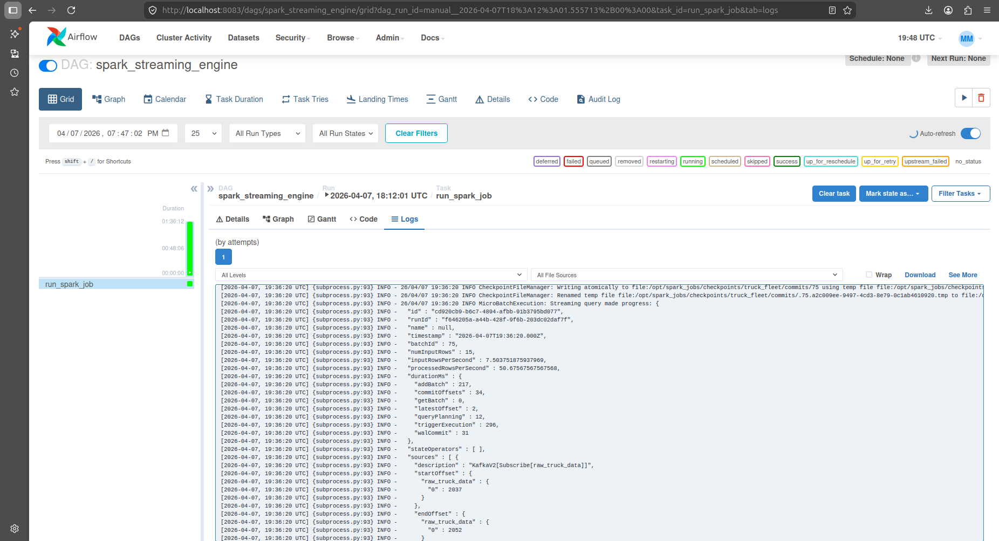
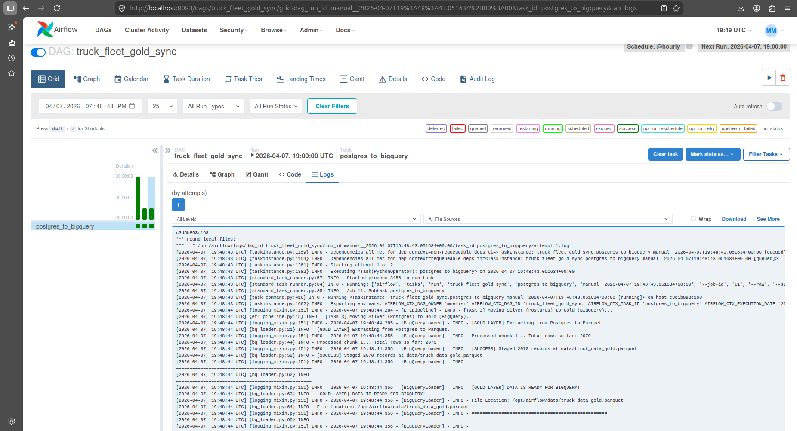
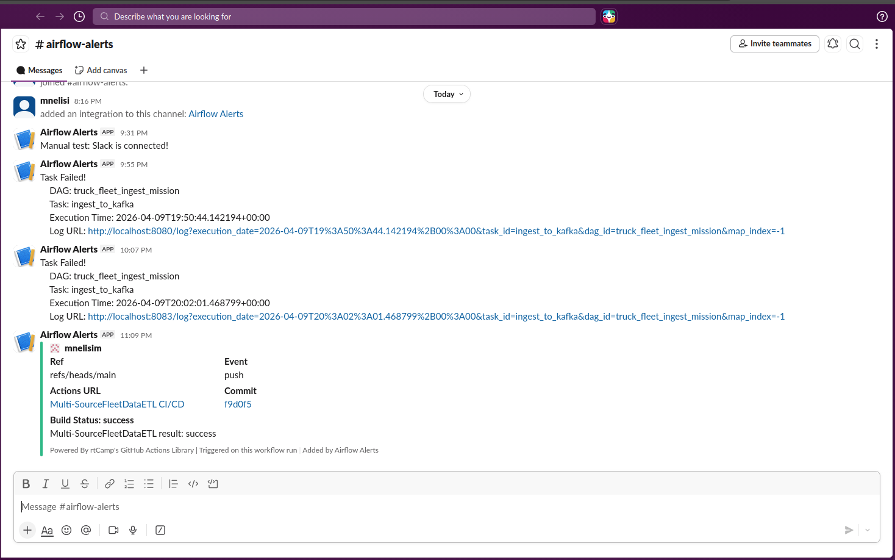
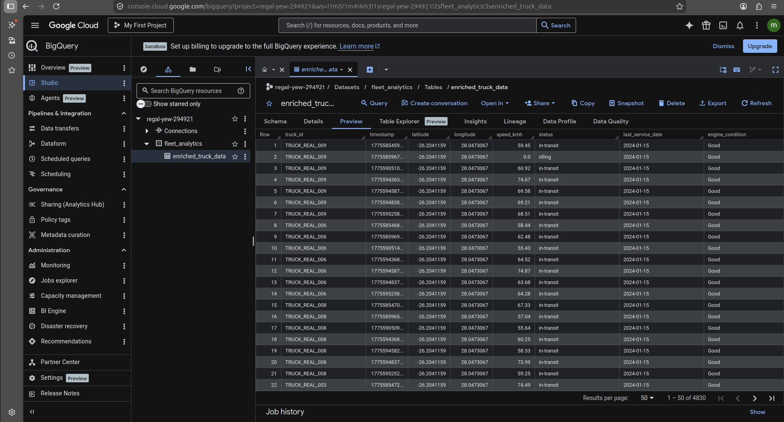

## Real-Time Multi-SourceTruckFleetDataETL Pipeline

### High-Concurrency Streaming Analytics with Spark, Kafka & Airflow

**End-to-end real-time data pipeline processing IoT fleet telemetry using Kafka, Spark Structured Streaming, and Airflow.**

## Live Pipeline Demo
This 1-minute demo shows the full pipeline in action:

- Data ingestion from simulator → Kafka  
- Real-time transformation with Spark (batch IDs updating)  
- Data loading into PostgreSQL (rows updating live)  
- Dashboard visualization with live truck locations and metrics

Click the image below to watch the live demo:

---

## Project Overview

This project implements a **production-style real-time data pipeline** designed to ingest, process, and analyze live GPS telemetry from a simulated fleet of 10 trucks operating in Johannesburg, South Africa.

The system follows a **Medallion Architecture (Bronze → Silver → Gold)**, transforming raw IoT events into **queryable, business-ready insights**.

---

## The Problem

Fleet management systems require **low-latency decision-making** for:

* Route optimization
* Driver safety monitoring
* Vehicle health tracking

Traditional batch pipelines introduce delays that make them unsuitable for these use cases.

---

## The Solution

I designed a **high-concurrency streaming architecture** capable of:

* Handling **simultaneous event ingestion (10 parallel producers)**
* Processing data in **real-time using Spark Structured Streaming**
* Ensuring **fault tolerance and data consistency via checkpointing**

---

## Architecture (Medallion Layers)

### 🔹 Bronze Layer (Raw Ingestion)

* Multi-threaded Python producer simulating GPS telemetry
* Apache Kafka used as a **distributed event streaming backbone**
* Decouples producers and consumers for scalability

---

🔹 Silver Layer (Processing & Enrichment)

  * PySpark Structured Streaming: Scalable real-time engine processing Kafka feeds.
  * Real-time Transformations:
      - Stream-Static Joins: Enriching raw telematics with Driver and Maintenance dimensions.
      - Data Quality Gates: Multi-stage validation including schema enforcement, coordinate range-checking, and impossible-speed filtering.
      - Data Cleaning: Handling GPS noise, null values, and string standardisation.
  * Persistence: Outputs high-integrity, enriched records to the PostgreSQL Serving Layer.
  * Streaming Data Quality: Real-time batch monitoring that detects and alerts on "Zero-Payload" events, preventing silent pipeline failures.
---

### 🔹 Gold Layer (Analytics & Storage)

* Airflow-orchestrated batch pipeline
* Writes optimized **Parquet files (columnar storage)**
* Designed for ingestion into Google BigQuery for analytics

---

### Visualization Layer

* Streamlit dashboard for:

  * Real-time fleet tracking
  * Fleet health monitoring
* Streamlit used for analytical exploration

## ETL Pipeline with Apache Airflow

The ETL pipeline orchestrates the extraction, transformation, and loading:

1. Data Ingestion
   - Simulator generates raw data, which is streamed to Kafka in real-time.
   - Kafka acts as the message broker to ensure reliable data delivery.
2. Data Transformation & Cleaning
   - Apache Spark consumes Kafka streams for real-time transformation.
   - Data is cleaned, validated, and aggregated for downstream analysis.
4. Data Storage
   - Transformed data is extracted from PostgreSQL (batch data).
   - Data is saved in Parquet format for BigQuery efficient storage and query performance.

# Airflow DAGS Overview

1. Truck_fleet_ingest_mission

2. Spark_streaming_engine

3. Truck_fleet_gold_sync

This image shows the DAG structure with separate tasks for extract, transform, load.

### Monitoring & Alerts
- **High Availability**: Implemented a custom alerting system to ensure data reliability.
- **Fail-Safe**: If any task fails, Airflow triggers a callback that sends an instant notification to Slack.
- **CI/CD Notifications**: GitHub Actions provides real-time updates on build and deployment status.

**Alert Notification:**

1. Task and CI/CD

2.Data Quality

## Dashboard – Real-Time Fleet Monitoring

The Streamlit dashboard displays live insights from the ETL pipeline:

- Real-time truck speed and driver info  
- Fleet-wide metrics (average & max speed)  
- Engine health distribution  
- Live GPS tracking on map  

## BigQuery – fleet_analytics

This dataset contains the processed (gold layer) truck fleet data, loaded from the ETL pipeline.

- Data is transformed using Spark
- Stored in BigQuery for analytics and querying
- Represents the final stage of the pipeline

---

## Technical Challenges & Solutions

### 1. Distributed State & Checkpoint Locking

**Challenge:**
Spark streaming jobs failed with:

* `CONCURRENT_STREAM_LOG_UPDATE`
* `FileAlreadyExistsException`

Caused by stale checkpoint locks from orphaned Docker processes.

**Solution:**

* Implemented **idempotent job lifecycle in Airflow**
* Cleaned stale state using controlled checkpoint resets
* Ensured safe recovery from last committed offsets

---

### 2. PySpark Serialization (NullPointerException)

**Challenge:**
Spark failed to serialize objects when writing to PostgreSQL due to:

* Logger instances
* Environment-based DB connections

Resulting in `java.lang.NullPointerException`.

**Solution:**

* Refactored sink logic to **initialize dependencies inside worker scope**
* Used **environment variable resolution at execution time**
* Ensured **safe serialization across distributed nodes**

---

### 3. Kafka Topic Synchronization

**Challenge:**
Spark attempted to read from topics before creation, causing:

* `UnknownTopicOrPartitionException`

**Solution:**

* Decoupled ingestion and processing into **independent Airflow DAGs**
* Configured Spark with `failOnDataLoss=false`
* Enabled **graceful waiting for upstream producers**

---

## Key Features

* **Exactly-Once Processing Semantics**
  Verified through consistent and repeatable batch outputs

* **Fault-Tolerant Streaming**
  Persistent checkpointing and Kafka offset management

* **Scalable Architecture**
  Designed for migration to **AWS (S3, EMR, MSK)**

* **Secure Configuration**
  No hardcoded credentials — fully environment-driven

---

## Tech Stack

* Orchestration: Apache Airflow
* Streaming Engine: PySpark Structured Streaming
* Messaging: Apache Kafka
* Storage:

  * PostgreSQL (serving layer)
  * Parquet (data lake format)
  * Google BigQuery (analytics)
* Environment: Docker, Ubuntu, Python 3.11

---

## How to Run

1. Clone the repository
2. Create a `.env` file (see `.env.example`)
3. Start services:

   -bash
   docker-compose up -d
   sudo chmod 666 /var/run/docker.sock
   docker exec -u root spark pkill -9 -f transform.py
   docker exec -u root spark rm -rf /opt/spark_jobs/checkpoints/truck_fleet/
   
4. Trigger Airflow DAGs:
   * `truck_fleet_ingest_mission`
   * `spark_streaming_engine`
   * `truck_fleet_gold_sync`
5. Access dashboard:

   -bash
   streamlit run dashboard.py

   * Streamlit → `http://localhost:8501`

## Future Improvements

* Automate BigQuery ingestion using GCP pipelines
* Implement schema registry (Avro/Protobuf)
* Add data quality checks (Great Expectations)
* Introduce monitoring (Prometheus + Grafana)

## Author

Mnelisi Masilela
BSc IT Graduate | Data Engineering Portfolio Project
